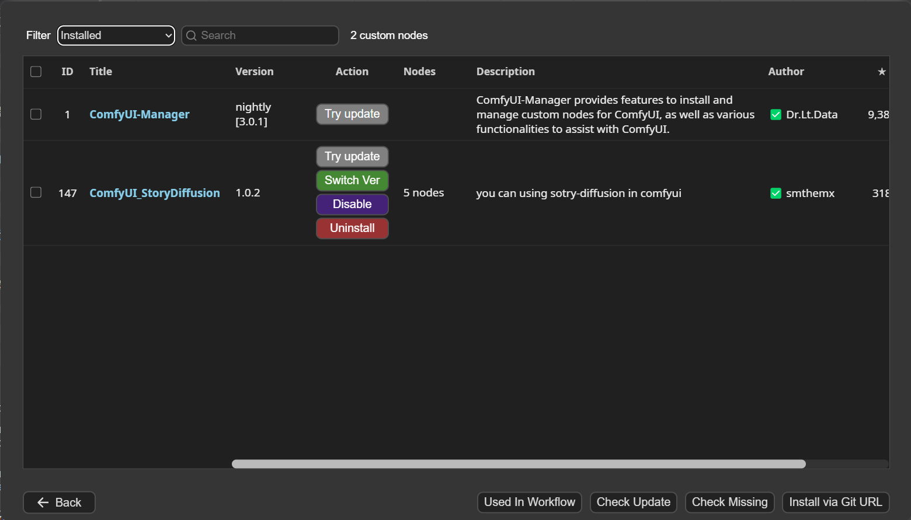
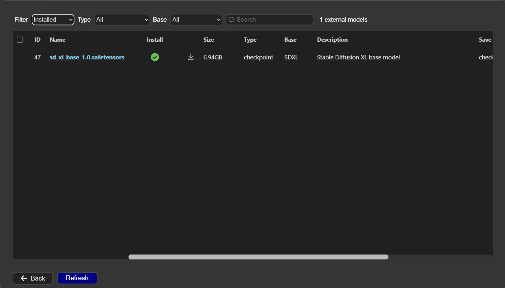
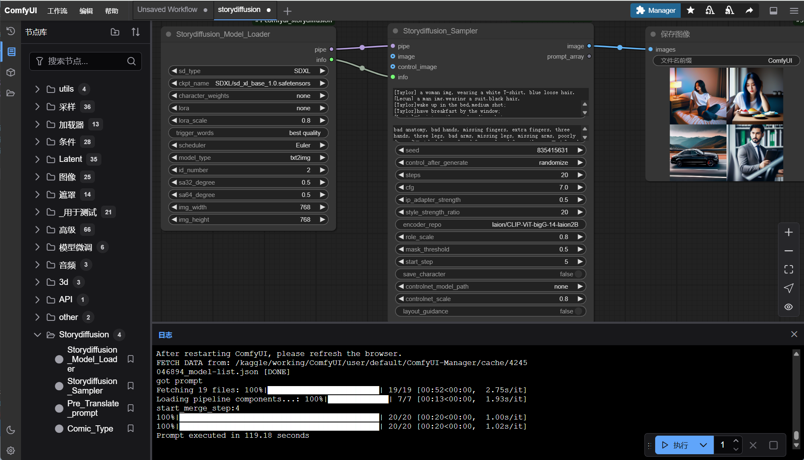

# JupyterNotebook


## 提交任务
```bash
curl --request POST \
  --url https://rnvnt-34-70-121-50.a.free.pinggy.link/prompt \
  --header 'X-Pinggy-No-Screen: X-Pinggy-No-Screen' \
  --header 'content-type: application/json' \
  --data '{
  "client_id": 1,
  "prompt": {
    "1": {
      "inputs": {
        "sd_type": "SDXL",
        "ckpt_name": "SDXL/sd_xl_base_1.0.safetensors",
        "character_weights": "none",
        "lora": "none",
        "lora_scale": 0.8,
        "trigger_words": "best quality",
        "scheduler": "Euler",
        "model_type": "txt2img",
        "id_number": 2,
        "sa32_degree": 0.5,
        "sa64_degree": 0.5,
        "img_width": 768,
        "img_height": 768
      },
      "class_type": "Storydiffusion_Model_Loader",
      "_meta": {
        "title": "Storydiffusion_Model_Loader"
      }
    },
    "2": {
      "inputs": {
        "info": [
          "1",
          1
        ],
        "character_prompt": "[Taylor] a woman img, wearing a white T-shirt, blue loose hair.\n[Lecun] a man img,wearing a suit,black hair.",
        "scene_prompts": "[Taylor]wake up in the bed,medium shot;\n[Taylor]have breakfast by the window;\n[Lecun] drving on the road,medium shot;\n[Lecun]work in the company.",
        "split_prompt": "",
        "negative_prompt": "bad anatomy, bad hands, missing fingers, extra fingers, three hands, three legs, bad arms, missing legs, missing arms, poorly drawn face, bad face, fused face, cloned face, three crus, fused feet, fused thigh, extra crus, ugly fingers, horn,amputation, disconnected limbs",
        "img_style": "No_style",
        "seed": 1185510095,
        "steps": 20,
        "cfg": 7,
        "ip_adapter_strength": 0.5,
        "style_strength_ratio": 20,
        "encoder_repo": "laion/CLIP-ViT-bigG-14-laion2B-39B-b160k",
        "role_scale": 0.8,
        "mask_threshold": 0.5,
        "start_step": 5,
        "save_character": false,
        "controlnet_model_path": "none",
        "controlnet_scale": 0.8,
        "layout_guidance": false,
        "pipe": [
          "1",
          0
        ]
      },
      "class_type": "Storydiffusion_Sampler",
      "_meta": {
        "title": "Storydiffusion_Sampler"
      }
    },
    "3": {
      "inputs": {
        "filename_prefix": "ComfyUI",
        "images": [
          "2",
          0
        ]
      },
      "class_type": "SaveImage",
      "_meta": {
        "title": "保存图像"
      }
    }
  }
}
'
```

## 查询处理状态
```shell
curl --request GET \
  --url https://rnvnt-34-70-121-50.a.free.pinggy.link/history/742f3efc-efeb-48df-8f73-74434a8af56e \
  --header 'X-Pinggy-No-Screen: X-Pinggy-No-Screen'
```

## 查询生成的图片
```shell
curl --request GET \
  --url 'https://rnvnt-34-70-121-50.a.free.pinggy.link/view?filename=ComfyUI_00007_.png&subfolder=&type=output' \
  --header 'X-Pinggy-No-Screen: X-Pinggy-No-Screen'
```





